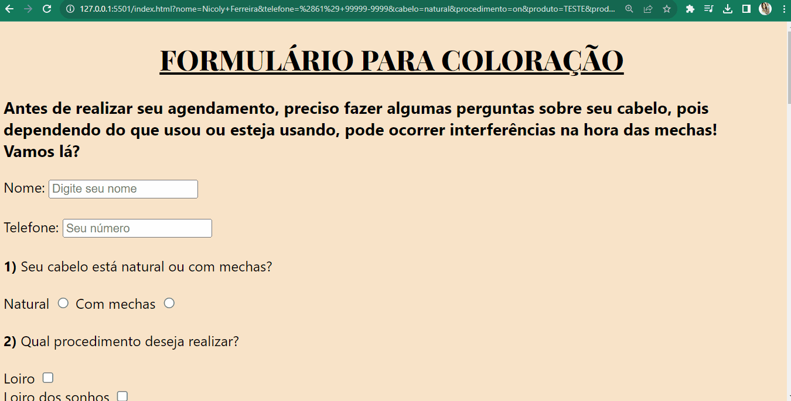

# Formulário Priscila Ferreira Hair.


### O projeto consiste em um questionário de anamnese para realização de coloração capilar e procedimentos químicos.




Foi utilizado a linguagem de marcação HTML e estilização com CSS.

Para a construção do formulário, usou -se a tag 

``` 
<form> method="GET"
```
com inputs de 

```
Text, Chackbox, Radio e Submit.
```


### Tecnologias utilizadas: 
- HTML;
- CSS.


Conforme há evolução nos conhecimentos em desenvolvimento web, insiro determinadas alterações.